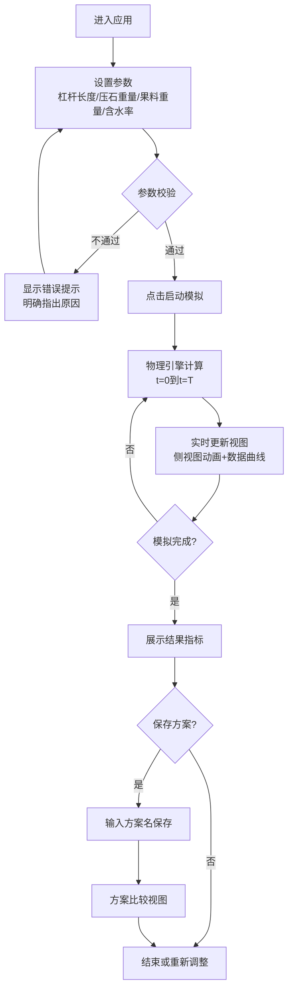

## 1. 产品概述
传统压榨机出汁效率模拟系统，用于研究不同结构参数和工艺参数对压榨效果的影响。
- 面向食品工程研究者、手工艺传承者和教学场景，提供直观的物理过程可视化
- 通过量化模拟帮助优化压榨工艺，提升出汁效率并减少残渣含水率

## 2. 核心功能

### 2.1 用户角色
| 角色 | 注册方式 | 核心权限 |
|------|----------|----------|
| 普通用户 | 无需注册，直接使用 | 调整参数、运行模拟、保存方案、查看比较 |

### 2.2 功能模块
1. **主模拟页面**：侧视图可视化、参数控制面板、实时数据曲线
2. **方案管理面板**：方案保存、加载、删除、多方案对比
3. **结果统计面板**：峰值压力、总出汁量、残渣含水率等关键指标

### 2.3 页面详情
| 页面名称 | 模块名称 | 功能描述 |
|----------|----------|----------|
| 主模拟页 | 侧视图可视化 | SVG绘制压榨机侧面结构，实时显示杠杆角度、压盘位置、果料压缩状态和出汁流动 |
| 主模拟页 | 参数控制面板 | 滑块/输入框调整杠杆长度、压石重量、果料重量、含水率，实时校验参数合法性 |
| 主模拟页 | 模拟控制区 | 开始/暂停/重置模拟按钮，模拟进度显示 |
| 主模拟页 | 实时曲线图 | 压力-时间曲线、出汁量累积曲线，双Y轴展示 |
| 主模拟页 | 结果指标卡 | 显示峰值压力(kPa)、总出汁量(mL)、理论含水量(mL)、残渣含水率(%)、出汁率(%) |
| 方案管理 | 方案列表 | 展示已保存方案，支持命名、加载、删除 |
| 方案管理 | 方案比较 | 表格对比多方案的关键指标，高亮最优值 |
| 主模拟页 | 提示系统 | 参数校验不通过、压力不足无法出汁等场景的明确提示 |

## 3. 核心流程
用户在参数面板调整杠杆长度、压石重量、果料重量和含水率，系统实时校验参数。参数合法后点击启动模拟，系统根据物理模型逐步计算压力传递、果料压缩和出汁过程，同时更新侧视图动画和数据曲线。模拟结束后展示结果指标，用户可保存方案并与其他方案进行对比。

## 4. 用户界面设计

### 4.1 设计风格
- **主色调**：暖棕色系 `#8B4513`（象征木质压榨机）+ 橄榄绿 `#556B2F`（象征果料）+ 琥珀金 `#DAA520`（象征汁液）
- **辅助色**：深灰 `#2C2C2C` 背景、米白 `#F5F0E6` 卡片、锈红 `#A0522D` 警示
- **按钮风格**：复古立体按钮，圆角4px，带微阴影和按压下沉效果
- **字体**：标题使用 `'Cinzel'` 衬线体（古典风格），正文使用 `'Source Serif Pro'` 衬线体
- **布局风格**：三栏式布局（左侧参数、中间可视化、右侧曲线+指标），卡片式容器带木纹纹理背景
- **图标风格**：线性复古图标，使用 Lucide 图标库配合暖色调

### 4.2 页面设计概述
| 页面名称 | 模块名称 | UI元素 |
|----------|----------|--------|
| 主模拟页 | 整体布局 | 深灰木纹背景、三栏黄金比例(1:1.6:1.2)、卡片悬浮微阴影、古典装饰边框 |
| 主模拟页 | 侧视图可视化 | SVG画布，木质纹理杠杆，石质压盘，渐变果料层，液滴出汁动画，网格坐标参考 |
| 主模拟页 | 参数控制面板 | 带刻度的复古滑块、数值输入框、参数标签带单位、错误状态红框提示 |
| 主模拟页 | 实时曲线图 | 双Y轴折线图，压力曲线锈红色、出汁曲线琥珀金色，图例、网格、悬停数据点 |
| 主模拟页 | 结果指标卡 | 五宫格指标卡，数值大号字体，单位小字，最优值高亮边框 |
| 方案管理 | 方案列表 | 可滚动卡片列表，方案名标签、创建时间、核心参数摘要、加载/删除按钮 |
| 方案管理 | 比较表格 | 多列对比表，行高优化，最优值背景色高亮，指标排序 |

### 4.3 响应式
桌面端优先(1280px+)，三栏并排；平板端(768-1279px)上下堆叠为参数区+可视化区+数据区；移动端(<768px)单列垂直滚动，可视化区域占满宽度。

### 4.4 动画与交互
- 页面加载：卡片错落渐入（staggered fade-in）
- 模拟运行：杠杆平滑摆动、压盘缓慢下降、果料层压缩形变、液滴从底部滴落动画
- 参数调整：滑块实时反馈，参数变化触发侧视图即时更新
- 悬停效果：按钮上浮+阴影加深，数据点高亮显示数值
