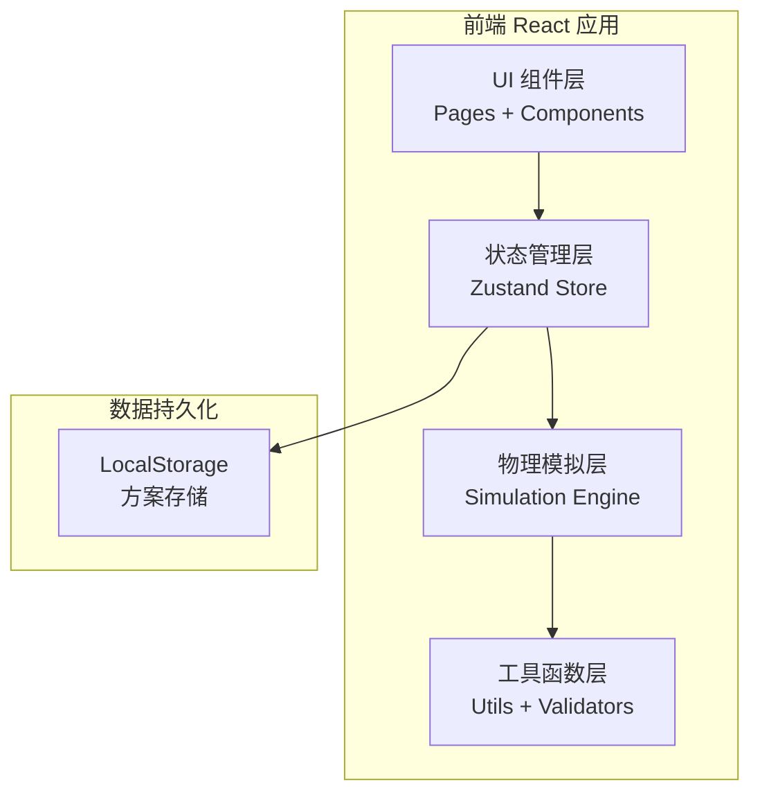
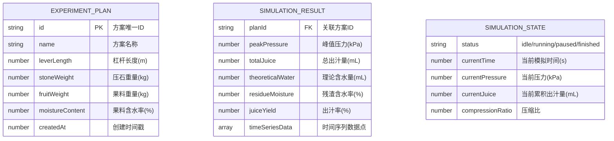

## 1. 架构设计



## 2. 技术描述
- 前端：React@18 + TypeScript + Vite
- 样式：TailwindCSS@3 + 自定义 CSS 变量（木纹纹理、复古配色）
- 状态管理：Zustand
- 图表：Recharts（React 图表库）
- 可视化：原生 SVG + CSS 动画
- 数据存储：LocalStorage（浏览器本地存储实验方案）
- 初始化工具：vite-init
- 后端：无（纯前端应用）

## 3. 路由定义
| 路由 | 用途 |
|------|------|
| / | 主模拟页面（包含所有功能模块） |

本应用为单页应用，所有功能模块在同一页面内通过组件切换展示。

## 4. 数据模型

### 4.1 数据模型定义



### 4.2 TypeScript 类型定义

```typescript
// 输入参数
interface PressParams {
  leverLength: number;      // 杠杆长度 (m), 必须 > 0
  stoneWeight: number;      // 压石重量 (kg), 必须 > 0
  fruitWeight: number;      // 果料重量 (kg), 必须 > 0
  moistureContent: number;  // 含水率 (%), 0-100
}

// 参数校验结果
interface ValidationResult {
  valid: boolean;
  errors: { field: string; message: string }[];
}

// 时间序列数据点
interface TimeSeriesPoint {
  time: number;             // 时间 (s)
  pressure: number;         // 压力 (kPa)
  juice: number;            // 累积出汁量 (mL)
  compression: number;      // 压缩比 (0-1)
}

// 模拟结果
interface SimulationResult {
  peakPressure: number;     // 峰值压力 (kPa)
  totalJuice: number;       // 总出汁量 (mL)
  theoreticalWater: number; // 理论含水量 (mL)
  residueMoisture: number;  // 残渣含水率 (%)
  juiceYield: number;       // 出汁率 (%)
  feasible: boolean;        // 是否可行
  infeasibleReason?: string;// 不可行原因
  timeSeries: TimeSeriesPoint[];
}

// 实验方案
interface ExperimentPlan {
  id: string;
  name: string;
  params: PressParams;
  result?: SimulationResult;
  createdAt: number;
}
```

## 5. 物理模拟核心算法

### 5.1 杠杆力学模型
```
支点位置: 杠杆左端为支点，压石作用点距离支点 = leverLength × 0.8
压盘作用点距离支点 = leverLength × 0.3

根据杠杆原理: F_stone × L_stone = F_press × L_press
=> F_press = F_stone × (L_stone / L_press)
=> F_press = stoneWeight × g × (0.8 / 0.3)
           = stoneWeight × 9.8 × 2.667
```

### 5.2 压强计算
```
压盘面积 A = 0.1257 m² (直径 40cm 的圆形压盘)
压强 P = F_press / A (Pa) = F_press / A / 1000 (kPa)
```

### 5.3 出汁模型
```
理论含水量: theoreticalWater = fruitWeight × 1000 × moistureContent / 100 (mL)
            （假设果料密度≈1g/mL，1kg=1000mL）

临界压力阈值: P_threshold = 50 kPa（低于此压力无有效出汁）

出汁速率模型:
当 P(t) < P_threshold: dV/dt = 0
当 P(t) >= P_threshold:
    dV/dt = k × (P(t) - P_threshold) × (1 - V(t)/V_max)
    其中 k = 0.0015 mL/(s·kPa) 为出汁系数
    V_max = theoreticalWater 为理论最大出汁量

压缩模型:
压缩比随时间变化: compression(t) = 1 - exp(-t/τ) × (1 - compression_max)
其中 τ = 20s 为压缩时间常数
     compression_max = min(0.7, P(t)/P_max) 为最大压缩比
```

### 5.4 残渣含水率
```
残渣干重 = fruitWeight × (1 - moistureContent/100) (kg)
残渣总重 = fruitWeight - totalJuice/1000 (kg)
残渣含水率 = (残渣总重 - 残渣干重) / 残渣总重 × 100 (%)
```
